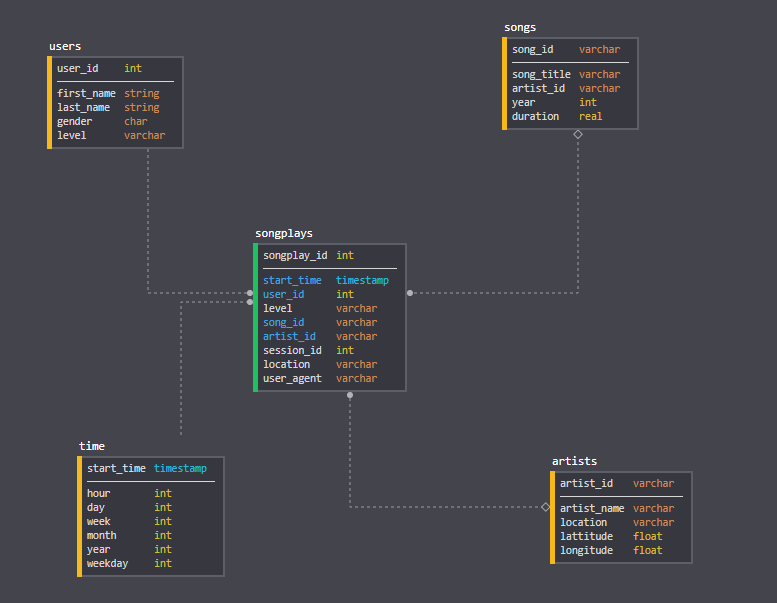

# Project: Data Lake

## Introduction
A music streaming startup, Sparkify, has grown their user base and song database even more and want to move their data warehouse to a data lake. Their data resides in S3, in a directory of JSON logs on user activity on the app, as well as a directory with JSON metadata on the songs in their app.

As their data engineer, you are tasked with building an ETL pipeline that extracts their data from S3, processes them using Spark, and loads the data back into S3 as a set of dimensional tables. This will allow their analytics team to continue finding insights in what songs their users are listening to.

You'll be able to test your database and ETL pipeline by running queries given to you by the analytics team from Sparkify and compare your results with their expected results.

## Project Description
In this project, you'll apply what you've learned on Spark and data lakes to build an ETL pipeline for a data lake hosted on S3. To complete the project, you will need to load data from S3, process the data into analytics tables using Spark, and load them back into S3. You'll deploy this Spark process on a cluster using AWS.

## Document Process

> Discuss the purpose of this database in the context of the startup, Sparkify, and their analytical goals.

As Data Engineer at Sparkify I'm going to design star schema model to processes of quering the data about the users patern on our music platform. In resent time company has seen very good growth and our team wants to move the data to the cloud. We decided to go with AWS which offers best solution to our current need. Move to the cloud enables us to contine to grow business and users community without concern about infrastructure issues. Business really wants to focus on what is really important to the core business model: Offer the best experience to the customer when it comes to listening to the music.

I have used Star Schema Model to design the database but we are going to take the advantage of the Apache Spark on top of a cluster powered by Amazon Elastic MapReduce,
a web service that enables businesses, researchers, data analysts, and developers to easily and cost-effectively process vast amounts of data. We have got one Fact table, "songplays" along with four more Dimension tables named "users", "songs", "artists" and "time". We have also developed an automated pipeline to transfer all the informations from JSON files also stored in the cloud (Amazon Simple Storage Service or Amazon S3, in short) to the cluster using Python. Then, after processing the data we saved back the tables to a repository in S3.

Amazon EMR is the industry leading cloud-native big data platform, allowing teams to process vast amounts of data quickly, and cost-effectively at scale. Using open source tools such as Apache Spark, Apache Hive, Apache HBase, Apache Flink, and Presto, coupled with the dynamic scalability of Amazon EC2 and scalable storage of Amazon S3, EMR gives analytical teams the engines and elasticity to run Petabyte-scale analysis for a fraction of the cost of traditional on-premise clusters.
